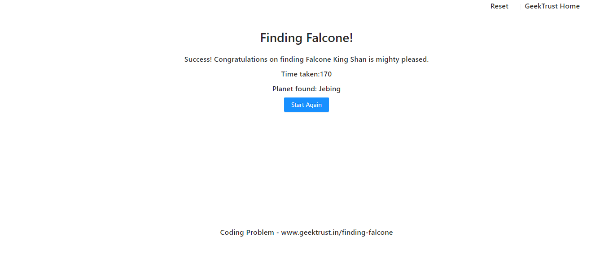
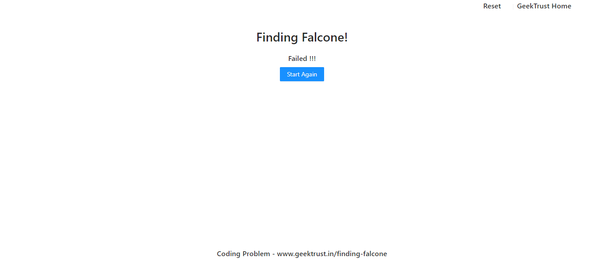

# Geek Trust - Frontend Challenge Space - Finding Falcone Solution
This is a solution to the [Frontend Challenge Space - Finding Falcone on Geek Trust](https://www.geektrust.in/coding-problem/frontend/space).  

## Table of contents

- [Geek Trust - Frontend Challenge Space - Finding Falcone Solution](#geek-trust---frontend-challenge-space---finding-falcone-solution)
  - [Table of contents](#table-of-contents)
  - [Overview](#overview)
  - [The challenge](#the-challenge)
  - [Screenshots](#screenshots)
    - [Home Page](#home-page)
    - [Success Page](#success-page)
    - [Failure Page](#failure-page)
    - [Links](#links)
  - [My process](#my-process)
    - [Built with](#built-with)
  - [How to Run](#how-to-run)
  - [Author](#author)
## Overview
Our problem is set in the planet of Lengaburu…in the distant
distant galaxy of Tara B. After the recent war with neighbouring
planet Falicornia, King Shan has exiled the Queen of Falicornia
for 15 years.
Queen Al Falcone is now in hiding. But if King Shan can find
her before the years are up, she will be exiled for another 15
years….

King Shan has received intelligence that Al Falcone is in hiding in one of these 6 planets - DonLon, Enchai, Jebing,
Sapir, Lerbin & Pingasor. However he has limited resources at his disposal & can send his army to only 4 of these
planets.
Your coding problem is to help King Shan find Al Falcone
## The challenge
You need to build a UI through which King Shan can
- select 4 planets to search (out of the total 6)
- select which space vehicles to send to these planets
- see how much time it will take for the vehicles to reach their targets &
- show final result of success or failure 

## Screenshots

### Home Page

### Success Page

### Failure Page

### Links

- Solution URL: [https://github.com/Aniket1298/findingfalcone](https://github.com/Aniket1298/findingfalcone)
- Live Site : [https://60c5af69ceffa87bcc93baa6--kingshan.netlify.app/](https://60c5af69ceffa87bcc93baa6--kingshan.netlify.app/)

## My process

### Built with

- Semantic HTML5 markup
- CSS custom properties
- Flexbox
- Mobile-first workflow
- [React](https://reactjs.org/) - JS library
- [Antd](https://ant.design/) - A design system for enterprise-level products
- [Prettier](https://prettier.io/) - An opinionated code formatter
## How to Run
- unzip the file or git clone https://github.com/Aniket1298/findingfalcone
- Run the following commands
- ## npm install
- ## npm start
## Author

- Github - [https://github.com/Aniket1298/](https://github.com/Aniket1298/)
- Linkedin - [https://www.linkedin.com/in/aniket1298/](https://www.linkedin.com/in/aniket1298/)
- Twitter - [https://twitter.com/Aniket74169420](https://www.twitter.com/Aniket74169420)
  